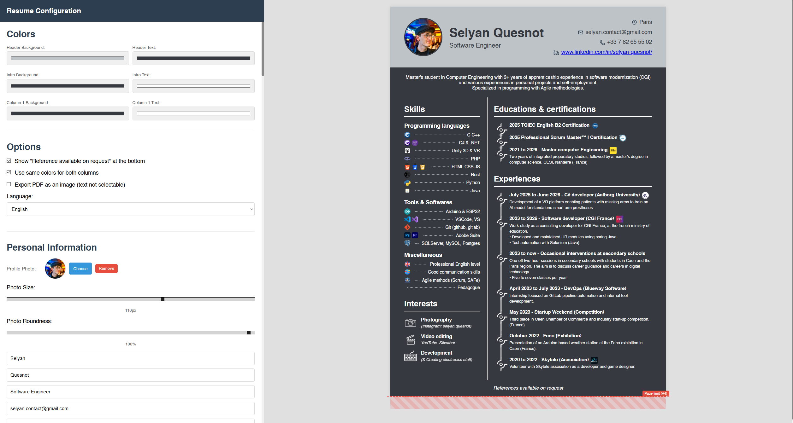

# Resume Generator

Browser-based resume builder (HTML/CSS/JS only) with live preview, PDF and JSON export, and English/French support.



https://silvauncompte.github.io/Resume-Generator/

## Features
- Edit personal info, introduction, skills (groups + icons), interests, education, and experience.
- Customize colors, column balance, and font size.
- Toggle synced column colors; optional selectable-text PDF or image-based PDF.
- Export to PDF, export/import JSON to reuse a configuration.
- Language selector (EN/FR) via the translations module.

## Requirements
- Modern browser (no server-side components).

## Run
1. Clone or download the repository.
2. Open `index.html` in your browser (directly or via any static file server).

## Export / Import

### PDF Export
- **Image-based**: Non-selectable snapshot of the resume (default, best for images).
- **Selectable text**: Hybrid approach with vector text overlay on rasterized background, supporting text selection and copying.
- Both modes preserve color scheme and layout within A4 bounds.

### JSON Export/Import
- Saves full configuration (personal info, skills, education, experience, interests, colors, fonts, preferences).
- Reuse configurations across multiple resumes or share with collaborators.

## Notes
- **Layout Constraints**: For best PDF fidelity, keep content within the visible A4 guide line in the preview.
- **Device Support**: Currently optimized for desktop/laptop viewing. Not properly adapted for mobile devices.
- **No Backend**: Everything runs in the browser; no Node or server dependencies required.

# ===== For technical user =====

## Project Structure
```
- index.html
- css/
	- base.css
	- config-panel.css
	- preview-panel.css
	- resume-styles.css
- js/
	- state.js
	- translations.js
	- font-utils.js
	- icon-manager.js
	- skills.js
	- interests.js
	- education.js
	- experience.js
	- preview.js
	- export.js
	- import.js
	- events.js
	- main.js
- images/
	- favicon.png
	- bullet.png
	- dash.png
```

## State Management (`state.js`)
Central state object storing all resume data and preferences (colors, fonts, personal info, skills, education, experience, interests).

### UI & Configuration
- **events.js**: Binds all input changes to state updates and preview rendering.
- **icon-manager.js**: Handles profile photo upload, cropping, timeline image management, and preview updates.
- **config-panel.css**: Styles for the configuration sidebar.

### Preview & Rendering
- **preview.js**: Builds live resume HTML from state with dynamic font scaling and layout.
- **preview-panel.css**: Styles for the preview container.
- **resume-styles.css**: A4-formatted resume layout and typography.

### Content Modules
- **skills.js**: Skill groups and icon management.
- **interests.js**: Interests section with images.
- **education.js**: Education/certification entries with timeline.
- **experience.js**: Work experience entries with timeline.
- **font-utils.js**: Font size scaling helpers.

### Import/Export
- **export.js**: PDF and JSON export with text-overlay mode support.
- **import.js**: JSON configuration import (which includes images)

### Internationalization
- **translations.js**: English and French translations for the result UI labels.

## License
Creative Commons Attribution-NonCommercial 4.0 International (CC BY-NC 4.0): you may use and modify the project, but commercial use is not permitted. See https://creativecommons.org/licenses/by-nc/4.0/
